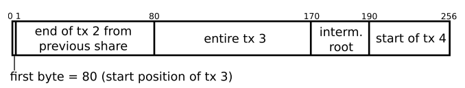

# Fraud Proof 欺诈证明

## 前提条件与预设结构

为了支持有效的欺诈证明，设计一个支持欺诈证明的区块链结构是很有必要的。
首先是一些基础的结构
>__H=(h0,h1,h2,...,hn)__ , 表示基于hash链的区块头链
>__hi={txRooti=root(Ti)}__, 表示每个区块头hi包含交易列表Ti的Merkle根txRooti
>节点(node)从网络中下载交易Ni,hi会在以下情况视其为合法(i)root(Ni)=ri且(ii)有效性函数 __valid(T,S)__ 返回为true,其中T是交易列表，S是区块链的状态，当且仅当中间状态$I^n_i$$\neq$err。
>Ti =($t^0_{i}$,$t^1_{i}$,$t^n_{i}$)
>$t^j_i$表示区块i的交易j
>__transition(S,t)$\in${S',err}__ 是一个状态转移函数，返回后状态S’，或者错误err
>__$I^j_i$=transition($I^{j-1}_i$,$t^j_i$)__ 表示每次应用交易$t^0_i$,$t^1_i$,...,$t^j_i$后区块链在区块i处的中间状态(intermeidate state)

在有了这些基础结构之后,我们需要再增加一些内容，来满足我们进行欺诈证明的需求
>__prevHashi__ 表示链中前一个区块头的hash
>__dataRooti__ 表示块中包括的数据(例如，交易)的Merkle树的根，在实际的应用中，区块的头部通常包含交易的Merkle根，这里是我们对其的抽象，并命名为此
>__dataLengthi__ 表示dataRooti的叶子数量
>__stateRooti__ 表示代表区块链状态(state of blockchain)的稀疏Merkle树的根
>__additionalDatai__ 网络可能需要的附加数据(例如，在工作证明中，这可以包括一个随机数和目标难度阈值)

此外，每个区块头部的hash __blockHashi = hash(hi)__ 也被客户端(clients)和节点保存。

## 不同记账模式下的键值对映射和状态转化

为了实例化前面描述的基于状态模型的区块链，我们利用了稀疏Merkle树，并且将状态表示为键值映射(key-value map)，其中常见的两种模式，分别是基于UTXO的区块链和基于账户的区块链，他们有如下不同实现方式

- 基于UTXO：映射中的键是交易输出标识符(transaction output identifiers)，例如hash(hash(d)||i)，其中d是交易的数据，i是d中引用的输出的索引。每个键的值是每个交易输出标识符的状态：要么是unspent(1)，要么是nonexistent(0，默认值)。
- 基于账户：在这种模式下，其本就已经是一个键值映射，其中键是账户或者存储的变量名，值是账户余额(balance)或者变量的值

状态可能需要跟踪所有的那些和区块处理相关的数据，包括而不限于每次交易之后支付给当前块的创建者的累计交易费用。
现在我们需要定义一个上面提到的transiton()函数的变体，我们在这里称其为 __rootTransition()__ ，它不需要所有状态就能执行状态转化，对于其参数，包含交易读取或者修改的状态树的状态根和Merkle证明，我们可以将其概括为 __状态见证__ (state witness)，用w来表示
这些Merkle证明可以被有效地表示为一个具有相同状态和公共根的子树，于是我们可以这样表示这个函数
> __rootTransition(stateRoot,t,w)$\in${stateRoot',err}__

其中状态见证包含一系列键值对和它们关联着的状态树的稀疏Merkle证明，表示为
>w={($k_1$,$v_1$,{$k_1$,$v_1$$\longrightarrow$stateRoot}),($k_2$,$v_2$,{$k_2$,$v_2$$\longrightarrow$stateRoot}),...,($k_n$,$v_n$,{$k_n$,$v_n$$\longrightarrow$stateRoot})}
在执行由w状态展示部分的t后，如果t改变了任何状态，那么接下来新的结果stateRoot'就能够通过计算根来生成，这个根是指的拥有改变了的叶子节点的子树的根。注意如果w是非法的而且并不包含t执行过程中的所有状态的部分，那么这个函数就会返回err。
让我们表示，对于交易列表Ti =($t^0_{i}$,$t^1_{i}$,$t^n_{i}$),其中$t^j_i$表示区块i处的交易j，而$w^j_i$是对于这个交易的stateRooti的状态见证
从而再每次应用交易后都会给出中间状态根，即$interRoot^j_i$=rootTransition($interRoot^{j-1}_i$,$t^j_i$,$w^j_i$)，而base case是$interRoot^{-1}_i$=stateRooti-1，此时stateRooti=$interRoot^n_i$。因此，$interRoot^i_j$表示的是在区块i应用一批交易$t^0_i$,$t^1_i$,...,$t^j_i$之后的中间状态根。

## 一些参数的数据结构

下面我们来详细描述提到的dataRooti。
数据由一个区块的dataRooti表示，其包含了排列成固定大小的数据块(称为share)的交易，和在交易之间穿插着的称之为trace的中间状态根。我们将$trace^j_i$称为区块i的第j个中间状态根。固定大小的目的是为了提供更好的数据可用性。
share在某些时候可能不能包含完整的交易，而是保存交易的一些部分。

如图所示，这个256byte大小的share中，不仅包含了完整的tx3，也包含了来自前一个share的tx2的尾巴和tx4的开头。我们一般将share中的第一个byte保留作为第一个新交易(图中的tx3)在share中开始的位置，或者置为0表示这个share中没有新的交易开始。
这样，share就可以首位相连的组成一个列表了，我们可以将其表示为(sh0,sh1,...shn)，于是我们需要一个解析函数来解析这种列表，我们定义一个函数如下
> __parseShares((sh0,sh1,...shn)) = (m0,...,mt)__

对于这一个函数,其输出(...mt)是 _t_ 的列表信息，这个 _t_ 要么是一些交易，要么就是中间状态根。
请注意，由于区块数据不必再每次交易之后都要包含中间状态根，于是我们在这里假定一个“周期标准(period criterion)”协议，这个协议定义了区块数据多久应该包含一个中间状态根。例如，可以设定为p次交易后包含一个中间状态根，或者是b字节以后，亦或者是消耗了g gas(以太坊)之后。
为了实现上面提到的周期标准协议,我们需要一个新的函数,我们在这里将其命名为parsePeriod，用它来解析上面那个列表 _t_ ，然后获得前状态中间根(pre-state intermediate root)$trace^x_i$，后状态中间根(post-state intermediate root)$trace^{x+1}_i$，以及一个包含交易的列表($t^g_i$,$t^{g+1}_i$,...,$t^{g+h}_i$)，当应用这些交易与$trace^x_i$之上时，预计会返回$trace^{x+1}_i$。经过这个函数的处理，我们能够发现 _t_ 列表是否违反了前面所提到的周期标准协议，如果其违反了，那么函数就会返回错误信息。于是，函数可以被这样表示出来。
> __parsePeriod((m0,...,mt))$\in${($trace^x_i$,$trace^{x+1}_i$,($t^g_i$,$t^{g+1}_i$,...,$t^{g+h}_i$)),err}__

当然如果前状态根没有被解析，$trace^x_i$也可能时空的(nil)，这种情况可能发生在区块的第一个消息(message)正在被解析时，因此，前状态根时前一个的区块的stateRooti-i的状态根。同样地，$trace^{x+1}_i$也有可能是空的，因为没有后状态根被解析。即如果区块中最近的消息正在被解析，此时后状态根将会是stateRooti。

## 对于非法状态转化的证明
下面让我们来讨论对于非法状态转化的证明，首先我们要了解什么情况下会产生非法状态证明。
>通常来说，一个错误的或者恶意的矿工可能会提供一个不正确的stateRooti。

为了解决这个问题，我们需要去分析stateRooti中的信息。于是我们发现，我们可以使用dataRooti提供的执行(execution)trace来证明执行trace中的某些部分是否正确。
为了验证这些数据，我们需要一个函数来执行，我们在这里定义一个用来验证的函数，命名为 __VerifyTransitionFraudProof()__ 此外，我们在这里申明一个参数$d^j_i$，其含义为区块i中的share数量j。
对于一个欺诈证明，其组成成分如下
> 区块中包含坏(bad)状态交易的相应的share
> 这些share的Merkel证明
> 这些share中包含的交易的状态注释

于是函数就可以被这样表达
>VerifyTransitionFraudProof(blockHashi,
($d^y_i$ , $d^{y+1}_i$ , ..., $d^{y+m}_i$), y, 
 _(shares)_ 

({$d^y_i$$\longrightarrow$dataRooti}, {$d^{y+1}_i$$\longrightarrow$dataRooti}, ..., {$d^{y+m}_i$$\longrightarrow$dataRooti}),
($w^y_i$ , $w^{y+1}_i$ , ..., $w^{y+m}_i$ ), 
 _(state witnesses)_ 

)$\in${true, false}

我们可以发现，这个函数的输入是欺诈证明。在收到输入后，函数将会检查在中间状态前根上的某个区块数据周期内应用交易是否会导致在块数据中指定的中间状态后根。(checks if applying the transactions in a period of the block’s data on the intermediate pre-state root results in the intermediate post-state root specified in the block data.)
如果没有，那么这个欺诈证明就是合法的，那么(导致)这个欺诈证明的区块就应当被客户端永久拒绝。

对于VerifyTransitionFraudProof()，从其输入来看，只有当其满足如下所有条件时，才会返回true
1. blockHashi能够和客户端已经下载和保存的区块头部hi对应上；
2. 对于证明中的每一个share $d^{y+a}_i$，VerifyMerkleProof($d^{y+a}_i$,{$d^{y+a}_i$$\longrightarrow$dataRooti},dataRooti,dataLengthi,y+a)，返回值为true
3. 给定parsePeriod(parseShares(($d^y_i$ , $d^{y+1}_i$, ..., $d^{y+m}_i$)))$\in${($trace^x_i$,$trace^{x+1}_i$,($t^g_i$,$t^{g+1}_i$,...,$t^{g+h}_i$)),err}，返回值不能为空。如果$trace^x_i$是空，且y=0，那么结果为true，如果$trace^{x+1}_i$是空，而y+m=dataLengthi，结果也为true
4. 检查应用($t^g_i$,$t^{g+1}_i$,...,$t^{g+h}_i$)于$trace^x_i$上后产生的输出$trace^{x+1}_i$。正常情况下，每次在证明中应用交易以后，中间状态根都会有这样的输出，即$interRoot^j_i$=rootTransition($interRoot^{j-1}_i$,$t^j_i$,$w^j_i$)。如果$trace^x_i$不为空，那么base case是$interRoot^y_i$=$trace^x_i$，否则，$interRoot^y_i$=stateRooti-1。如果$trace^{x+1}_i$不为空，且$trace^{x+1}_i$=$interRoot^{g+h}_i$为真，否则stateRooti=$interRoot^{y+m}_i$为真